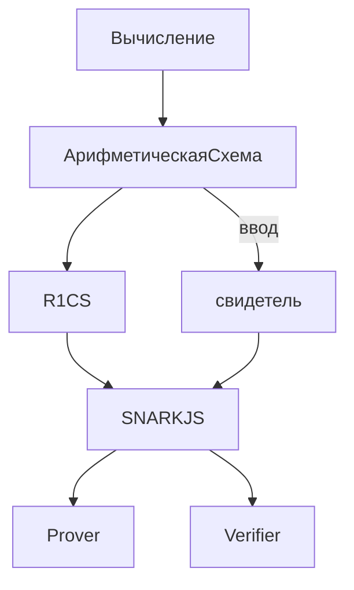
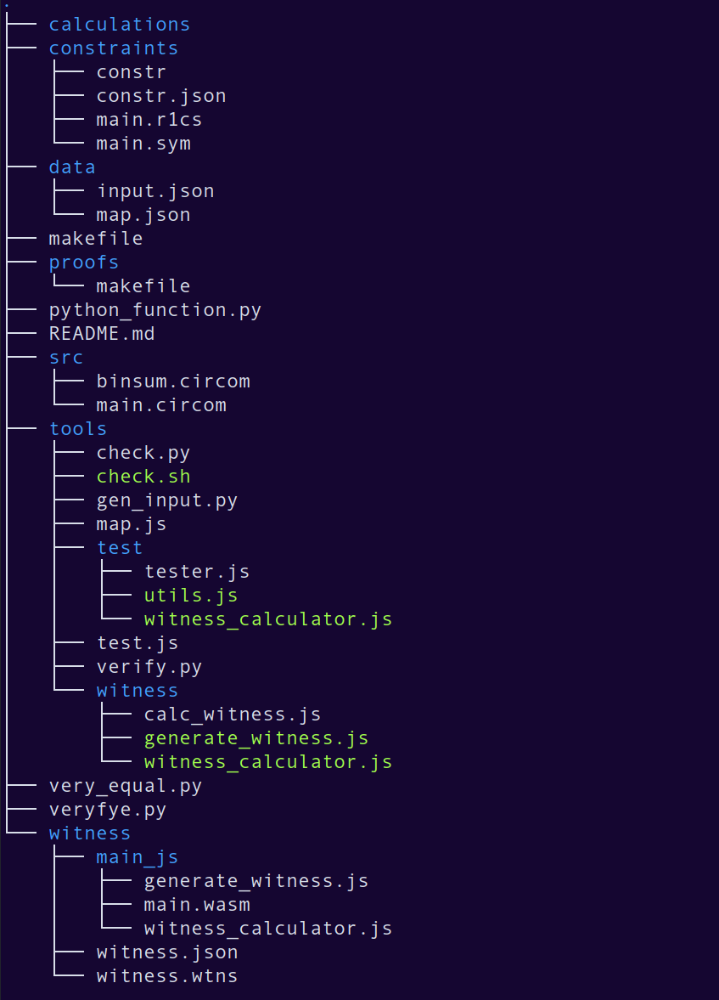

# Введение

С каждым годом количество сервисов, работающих в интернете растет с неимоверной скоростью. Все больше различных услуг доступно для обычных пользователей. Денежные переводжы, обмен сообщениями и письмами, аутентификация - все это желательно делать быстро и конфеденциально. С развитием криптографии оба пункта смогли быть покрыты. 
Однако со временем помимо защиты информации появилась большая потребность в обеспечении её целостности. В этих случаях информацию даже не обязательно как то скрывать, важно лишь доказать, что она не была изменена. Изначально эта потребность была удовлетворена цифровыми подписями. 
Одним из важнейших достижений криптографии за последние годы стали доказательства с нулевым разглашением( Zero-Knowledge Proofs, далее ZKP). В отличие от привычных нам доказательств, это метод, благодаря которому одна сторона может доказать другой стороне верность некоторого утверждения без раскрытия деталей самого утверждения. Идея ZKP появилась при исследовании новых способов аутентификации. Важная деталь аутентификации заключается в том, что доказывающей стороне нельзя доверять. ZKP же привносит идею того, что проверяющей стороне доверять также нельзя.
Значительную популярность ZKP получили из-за их значимости для блокчейна. Однако такие области как аутентификация, проверка вычислений(в том числе и zkEVM) и валидация источников новостей значительно выигрывают с использованием ZKP. 
Главными проблемами в реализации протоколов на основе ZKP долгое время была стандартизация формирования доказательств и недопустимое для массого использования время их проверки. Когда эти проблемы были частично решены, главной целью стало упрощене создания доказательств для разработчиков, не имеющих глубоких познаний в криптографии. Для этого были разработаны предметно-ориентированные языки (далее DSL) с синтаксисом, напоминающим привычные языки программирования. 
C каждым днем растет количество компаний, внедряющих ZKP в свои системы. В случае блокчейна  - ZKP помогают ускорить вычисления и сделать их дешевле. Логика написания программ на представленных сегодня DSL значительно отличается от написания обычных программ, тестирование которых хорошо изучено. В силу своей специфики, нахождение неисправностей является трудной задачей, а отладка попросту невозможна. Таким образом, необходимо разработать методы поиска ошибок в исполнении, а также вытекающих из них уязвимостей. В своей научной работе я собираюсь разработать средство автоматизации тестирования цепей доказательств с нулевым разглашением прим помощи символьного исполнения.  


# 1 Доказательства с нулевым разглашением

В данной главе будет рассказано про принципы работы ZKP.

## 1.1 Интерактивные  системы доказательств
Интерактивные системы доказательств - протокол, позволяющий с некоторой вероятностью убедить проверяющую сторону в верности утверждения доказывающей стороны.

Введем две сущности: Доказывающий(Prover) и Проверяющий(Verifier), далее P и V.

Интерактивная система доказательств должна обладать следующими свойствами:

- Completeness(Полнота) - если утверждение P верно, то он сможет убедить в этом V(по крайней мере с большой вероятностью).
- Soundness(Корректность) - P не сможет заставить V принять его доказательство, если оно ложно, или сможет, но только с незначительной вероятностью.

Доказательство P является аргументом знания, если P действительно знает некотрую информацию, при помощи которой это доказательство можно создать.

##  1.2 Доказательства с нулевым разглашением
ZKP(Zero-Knowledge proofs, Доказательства с нулевым разглашением) - это доказательства, которые позволяют убедить проверяющую сторорну в их достоверности и в то же время не раскрывают ничего, кроме факта верности доказываемого утверждения[1].

Задачей ZKP является сокрытие любой важной информации, необходимой для формирования доказательства.

Так как изначально ZKP задумывались как интерактивный протокол, к свойствам интерактивной системы доказательств добавляется еще одно важное свойство:
- Zero-Knowledge(Нулевое разглашение) - V не узнает ничего нового об утверждении P после получания доказательства, кроме его верности.

Существует несколько типов нулевого разглашения:

1. Идеальное нулевое разглашение(perfect zero-knowledge, PZK) - даже сторона c неограниченными ресурсами не способна подделать доказательство.
2. Статистическое нулевое разглашение(statistical zero-knowledge, SZK) - сторона с неограниченными ресурсами для вычислений способна подделать доказательство с незначительной вероятностью.
3.  Вычислительное нулевое разглашение(computational zero-knowledge, CZK) - не существует эффективного алгоритма, который способен подделать доказательство за разумное время.

Задача подделывания доказательства является ключевой для злоумышленника.

Так как CZK проще всего реализуется, оно является самым распространенным типом нулевого разглашения. Протоколы на основе CZK используют в своей работе надежные криптографические примитивы.

## 2 Аспекты программной реализации ZKP

В данной главе будут рассмотрены основные детали программной реализации ZKP.

## 2.1 Арифметические схемы
В теории компьютерных вычислений, арифметическая схема - стандартная модель для вычисления многочленов. В данной модели можно складывать или умножать выражения, которые уже были вычислены, на основе входных данных. Формально это ориентированный ациклический граф. Каждая вершина с нулевой степенью входа - входной вентиль(input gate). Каждая грань - провод(wire). Каждый вентиль имеет два входных и один выходной провод [6].


Рисунок 2 - арифметическая схема для многочлена $(x_1 + x_2)x_2(x_2 + 1)$

Выполнение Арифметической схемы означает последовательное выполнение всех операций на всех вентилях. В случае использования арифметических схем в ZKP, считается свидетель(witness) - значения на всех проводах такиe, чтобы входы и выходы каждого вентиля удовлетворяли ограничению, определяемому операцией вентиля. На рисунке 2 свидетелем является w = (s1, s2, s3, s4, s5, s6, s7, s8, s9). И все они удовлетворяют ограничениям:

$$1)\ s_1 + s_2 = s_6\\2)\ s_4 + s_5 = s_7\\3)\ s_3 s_6 = s_8\\4)\ s_8 s_7 = s_9\\5)\ s_2 = s_3 = s_4$$

## 2.1 Квадратичные арифметические программы и R1CS

R1CS - rank-1 constraint system(система ограничений ранга 1). Это последовательность строк, хранящая в себе значения, которым должны соответствовать переменные во время работы программы. Она же связывает отношения между всеми ними во время вычисления. Эти отношения называются “ограничениями”(constraints) или “вентилями”(gates) [8] [10].

Допустим, w = (s1, s2, s3, s4,…, sn). Тогда для каждого вентиля будут существовать такие линейные комбинации вектора w - Ai, Bi и Ci:

Ai * Bi - Ci = 0. Ai = (w, ai), Bi = (w, bi), Ci = (w, ci)
Где ai, bi, ci - система ограничений.
Наборы таких значений и будут составлять R1CS.

Пример к рисунку 2 для вентиля 4:

|  | a4 | b4 | c4 |
| --- | --- | --- | --- |
| 1 | 0 | 0 | 0 |
| 2 | 0 | 0 | 0 |
| 3 | 0 | 0 | 0 |
| 4 | 0 | 0 | 0 |
| 5 | 0 | 0 | 0 |
| 6 | 0 | 0 | 0 |
| 7 | 0 | 1 | 0 |
| 8 | 1 | 0 | 0 |
| 9 | 0 | 0 | 1 |

(w, a) * (w, b) - (w, c) = (s8 * 1) * (s7 * 1) - (s9 * 1) = 0. (w, a) - скалярное произведение векторов.

КАП(Квадратичная арифметическая программа, QAP) - специальная форма программы, которая получена из R1CS, преобразованием её в арифметическое выражение, с использованием многочленов. Это делается с помощью R1CS представления программы, все уравенения вида (w, ai) * (w, bi) - (w, ci)  = 0 могут быть записаны с помощью трех многочленов, которые принимают значения (w, i), (w, bi) , (w, ci) при определенном аргументе ri.

Многие ZK протоколы используют это представление.

Выполнимость арифметических схем - NP-полный язык. Значит для любого из NP-вычислений можно построить арифметическую схему для этого вычисления таким образом, что свидетель, удовлетворяющий схеме  - свидетель оригинального вычисления. Таким образом убеждаясь в правильности свидетеля для КАП, V одновременно убеждается в правильности свидетеля из оригинального вычисления [7].


# 3 Circom
В данном разделе будут рассмотрен предметно-ориентированный язык circom. Также будет рассмотрен компилятор для этого языка - circom compiler. 

Это один из самых первых и самых используемых dsl для написания схем на данный момент. Удобным для использования его также делает стандартная библиотека базовых примитивов, таких как операции с двоичным представлением числа, операции на эллиптических кривых, sha256 и т.д.

К примеру, Tornado Cash - децентрализованный протокол, который позволял анонимизировать транзакции в сети Etherium и ряде других блокчейнов, с использованием ZKP. В нем использовался circom, для формирования и проверки доказательств. Так же Tornado Cash называют монетным миксером - сервисом, который позволяет пользователям скрывать происхождение и назначение транзакций.

Circom и другие dsl используются для описания вычислений вместе с рядом ограничений на входные и выходные значения, называемые сигналами(signals). Существует два типа сигналов: открытые и закрытые. Открытые известны как P так и V, закрытые же являются секретом P.

## 3.1 Circom Language

Circom - предметно-ориентированный язык, который был разработан для написания арифметических схем используемых в ZKP. В частности он был разработан для работы с javascript библиотекой snarkjs [15].
В snarkjs реализованы базовые инструменты для работы со схемой. С её помощью можно генерировать cвидетеля, проводить церемонии довренной настройки, формировать доказательства и проверять их.

Circom позволяет создавать массивные схемы, используя много маленьких компонентов.
Этот язык с одной стороны подтверждает верность работы программы, а с другой стороны описывает все вычисления. Вычисление и Проверка - разные операции, описанные одной схемой.

Данный язык значительно отличается от привычных нам языков программирования. Одако синтаксис языка заимствуется у языков javascript и C с добавлением нескольких операций:

пример cхемы реализующей операцию **не и**

```jsx
pragma circom 2.0.0; 

template NAND() {
    signal input a;
    signal input b;
    signal output out;

    out <== 1 - a*b;
    a*(a-1) === 0;
    b*(b-1) === 0;
}

component main = NAND();
```

```c
<==, ==> - используются для передачи значений сигналов и наложения ограничений на сигналы
<--, --> - используются для передачи значений сигналов
=== - используется для наложения ограничений на сигналы
```

Как мы видим, есть два входных сигнала (a, b) и выходной сигнал (out).  Сигналу out присвоено значение 1 - a * b и наложено ограничение что out должен быть равен 1 - a * b при проверке.  Далее проверяется что a и b находятся в множестве {1, 0}.

Все ограничения должны быть в квадратичном виде.

Данная схема работает с элементами конечного поля по модулю простого числа p = 21888242871839275222246405745257275088548364400416034343698204186575808495617

## 3.2 Circom Compiler

Circom Compiler - компилятор языка circom, написанный на языке Rust. Он используется для генерации R1CS файла с ограничениям наложенными схемой и программой, которая будет эффективно cчитать свидетеля. Свидетель - набор значений, удовлетворяющий всем ограничениям, наложенным схемой. Также он создает программы prover и verifier. Prover может быть использован для вычисления схемы, используя открытые и закрытые входные сигналы, вместе с доказательством того, что вычисление было выполнено корректно. Verifier с помощью открытых входных сигналов и выходного сигнала вычисления может быть использован для  проверкт верности доказательства, созданного prover.



makefile с генерацией и проверкой доказательства находится в приложении.

# 4 Символьное исполнение 
В данной главе произведен анализ подхода к тестированию цепей доказательств с нулевым разглашением при помощи символьного исполнения.

Символьное исполнение - это средство анализа программы для определения того, какие входные данные вызывают выполнение каждой части программы. Оно полезно для генерации тестовых данных и подтверждения качества программы. Исполнение требует выбора путей, которые осуществляются набором значений данных. Программа, которая выполняется с использованием фактических данных, приводит к выводу ряда значений. В символьном исполнении данные заменяются символьными значениями с набором выражений, по одному выражению на выходную переменную [11]. Символьное исполнение позволяет проверить свойства программы, и то что результат работы нескольких программ всегда приводит к одинаковым значениям.

##  4.1 Тестирование цепей доказательств с нулевым разглашением

Выделяют три задачи тестирования цепей доказательств с нулевым разглашением при помощи символьного исполнения: 
1. Слабая верификация(Уникальный ввод/вывод)
    - Это тестируется, если для данного ввода, вывод КАП должен иметь однозначно определенные значения.
2. Уникальность свидетеля
    - Это тестируется, если все значения свидетеля, которые появляются во всех уравнениях, также определены однозначно.
3. Cтрогая уникальность
    - Это тестируется, если КАП строго эквивалентно некоторой математической спецификации.
    - Очень похоже на корректность работы функции.
[13]

## 4.2 SMT

SMT(Satisfiability Modulo Theories) - в CS и математической логике это проблема определения является ли математическая формула выполнимой. 
SMT solvers - утилиты(z3[12], cvc5[13]), преднозначенные для решения SMT для практического подмножества входных данных. Они используюятся в различных отраслях CS, в том числе в автоматическом доказательстве теорем, анализ программ, верификация программ и тестирования программного обеспечивания.
(добавить про smt-comp https://smt-comp.github.io/2023/).

Для дальнейшего использования была выбрана утилита z3.(дописать про питон).

## 4.3 Анализ подхода к тестированию

Преимущества подхода:
- Нивелирует определенный класс ошибок, которые бывает сложно выявить человеку во время аудита. Часто может найти всевозможные неисправности;
- Совместим с другими техниками тестирования, такими как фаззинг.
- Подходит для нахождения ошибок в арифметических схемах, ведь их структура сама по себе является набором уравнений;
- Большинство DSL для написания схем предоставляют инструменты для модульного построения программ, следовательно большие и сложные схемы легче проверять по частям;

Недостатки подхода:
-  Затраты человеческих ресурсов намного больше, чем при других подходах.
- Иногда невозможно провести верификацию на неограниченном вводе, поэтому приходится его ограничивать в соответствии с оценкой работы программы;
- Операции в арифметических схемах происходят в конечных полях характеристики большого простого числа, это накладывает ограничения на тестирование, вследствие специфики работы SMT утилит;

## 4.4 Алгоритм тестирования

При тестировании схемы необходимо разбить итоговую схему на подсхемы, определить что имеенно нужно протестировать для каждой подсхемы, 
(картинка с алгоритмом) и про разбиение на части.

### 4.4.1 Уникальный ввод/вывод
Основываясь на свойствах тестируемой программы, необходимо выяснить является ли ввод программы уникальным для данного вывода. 

Для тестирования уникальности ввода/вывода конструируется символьная модель программы. На различных входных данных тестируется совпадение выходных данных.

### 4.4.2 Строгая уникальность
Для проверки строгой уникальности необходима программная реализация проверямой схемы на одном из языков программирования, совместимая с символьным исполнением. 
На одинаковых входных данных вычисляются схема и программа, а затем они сравниваются и модель проверяется на выполнимость. 

# 5 Реализация 

В данной главе приведена реализация вышеизложенного алгоритма с помощью утилит circom, snarkjs, z3 и языков программирования python, javascript.

## 5.1 Структура директории

(названия доработать)


- makefile - это набор инструкций для программы make. 
- function.py - 
- very_equal.py - 
- veryfye.py - 
- src/ - 
- constraints/ -
- proofs/ -
- tools/ -
- witness/ -
- data/ - 

Дописать подробнее про анализ R1CS(map.js), tools/

## 5.1 Ручная спецификация

Для тестирования цепей необходимо сконфигурировать директорию в соостветсвии с несколькими требованиями:

- src/main.circom - содержит главную схему, которая вызывает все побочые схемы из директории src/
- python_function.py - содержит в семе программную реализацию проверяемой схемы на языке python совместимую с z3.
- very_equal.py, veryfye.py, very_equal.py - необходимо явно указывать тип переменных используемых во время вычислений.
- data/input.json - входные данные для схемы main.circom, которые необходимо проверить непосредственно.

# 6 Выбранные примитивы и результаты

В стандартной библотеке Circom - Cricomlib, представлено множество реализованных схем таких как: работа с числами в двоичной системе, хэш функции(SHA-256[], Poseidon[],  MiMC-7[]) , арифметические операции на эллиптических кривых[], цифровые подписи(eddsa[]) и другие. Эти примитивы разработчики могут использовать для создания своих собственных схем. 

добавить выбор SHA-256(бинарно) и несколько маленьких протестированных примитивов,скрины с результатами и пояснениями.

# Заключение 
В научно-исследовательской работы приведены описание доказательств с нулевым разглашением, а также аспекты программной реализации протоколов, построенных на ZKP. Рассмотрен язык для написания арифметических схем Crircom. Была обоснована актуальность задачи тестирования цепей доказательств с нулевым разглашением.
Был произведен анализ подхода к тестированию цепей доказательств с нулевым разглашением при помощи символьного исполнения, а также SAT solver утилиты z3.
Был приведен алгоритм тестирования цепей доказательств с нулевым разглашением при помощи символьного исполнения, а также представлена реализация алгоритма на языке программирования python.
В будующих исследованиях планируется отладить реализацию, протестировать больше примитивов из библиотек других утилит для написания и компиляции схем.
Поставленная цель научно-исследовательской работы была достигнута. Целесообразность дальнейшей работы заключается в усовершенствовании решений, реализующих алгоритм тестирования цепей доказательств с нулевым разглашением, предложенный в данной работе.

# Приложение

Много кода
