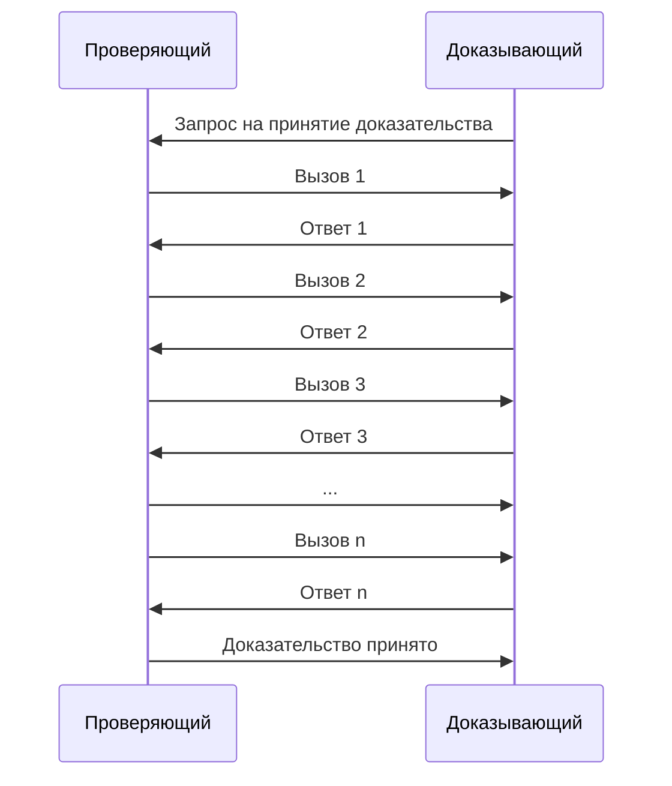
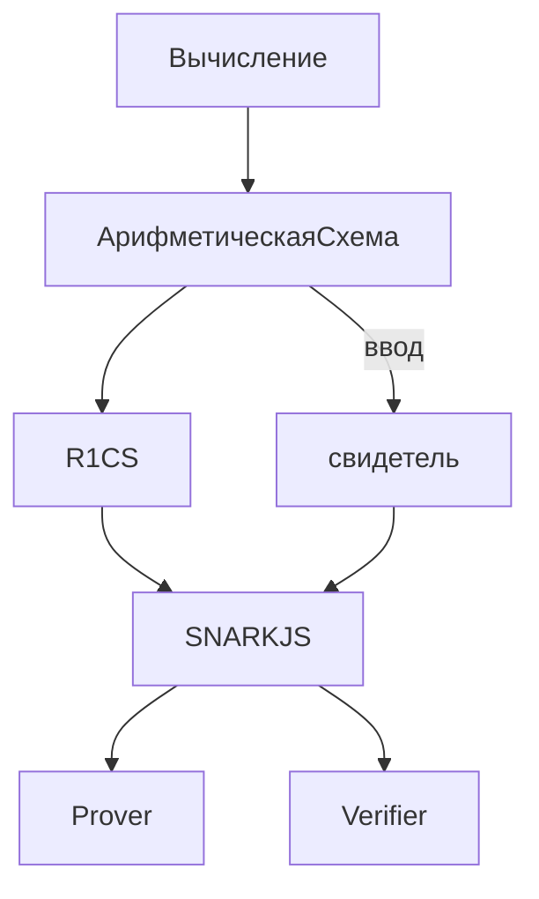
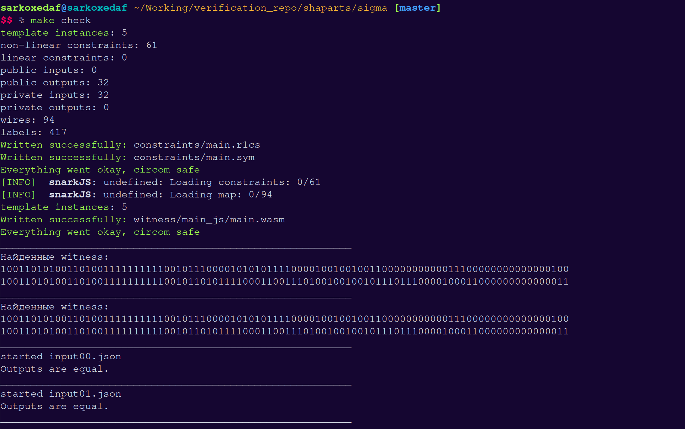
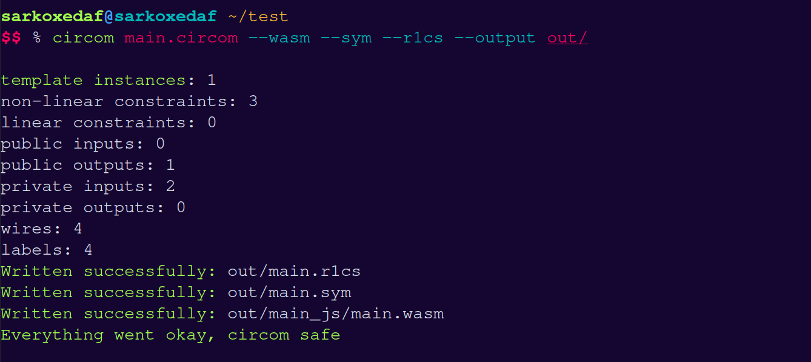

# final1

необходимые определения:
протокол, аутентификация, эффективность? алгоритм? метод?, узел?

# Введение

С каждым годом количество сервисов, работающих в интернете растет с неимоверной скоростью. Все больше различных услуг доступно для обычных пользователей. Денежные переводы, сообщения и письма, аутентификация - все это желательно делать быстро и конфиденциально. С помощью криптографии стало возможно покрыть второй пункт, а с грамотной реализацией и скорость перстает быть большой проблемой. Однако протоклы имеют свойство устаревать и поэтому появляются новые, более эффективные и надежные способы передачи информации.
Одним из важнейших достижений криптографии за последние годы стали "Доказательства с нулевым разглашением"(Zero-Knolwedge Proofs, далее ZKP). Этот метод передачи данных позволяет двум разным сторонам обмениваться информацией, ничего не раскрывая. Значительную популярность он получил в том числе изза своей значимости для blockchain(цепь блоков - база данных специального вида, которая поддерживается совместными усилиями всех узлов) и Internet of Things(IOT, интернет вещей). Более привычными же примерами использования ZKP являются: анонимное голосование и выборы, аутентификация, доказательства правдивости источников новостей, доказательства того, что ваши деньги не были у кого либо украдены.

Главными проблемами в реализации протоколов на основе ZKP долгое время были стандартизация формирования таких доказательств, а также большое время их проверки.Когда эти проблемы более менее решили, стало важнo упростить созданиe доказательств для обычных разработчиков без опыта в криптографии. В последние годы эта отрасль развилась значительно. Было представлено множество исследований на тему ZKP, предложены алгоритмы реализации формирования доказательств и их проверки, а также созданы новые предметно-ориентированные языки(далее dsl), позволяющие реализовать ZK(zero-knowledge) протоколы. Однако логика написания таких программ значительно отличается от привычных языков, следовательно необходимо разработать способы отладки программ и поиска уязвимостей в них.
В основном используют статический анализ, фаззинг и символическое(или все таки символьное) исполнение.

# 1 Доказательства с нулевым разглашением и их применение

В данной главе будет рассказано про принципы работы ZKP,  zk-SNARKs и PLONK.

## 1.1 Доказательства с нулевым разглашением

ZKP - это доказательства, которые позволяют убедить проверяющую сторону в их достоверности и в то же время не раскрывают ничего, кроме факта верности доказываемого утверждения [1].

Задачей ZKP является сокрытие любой важной информации, необходимой для формирования доказательства. Обычно стороны обозначают как Доказывающий(Prover) и Проверяющий(Verifier)(далее P и V).

Три главных свойста, определяющих ZKP:

1. Completeness(Полнота) - если утверждение P верно, то он сможет убедить в этом V(по крайней мере с большой вероятностью).
2. Soundness(Корректность) - P может убедить V в верности своего утверждения, только в случае, если оно действительно верно.
3. Zero-knowledge(Нулевое разглашение) - V не узнает ничего важного об утверждении P, кроме факта его верности.

Симулятор - любой вероятностный алгоритм, работающий за полиномиальное время, который способен симулировать результат взаимодействия некоторого V* с P и эта симуляция будет статистически неотличима от результата взаимодействия оригинального V с P. Причем симулятор не (видит?) их взаимодействия.

Существует несколько типов нулевого разглашения:

от симуляции настоящего доказательства( ввеасти симуляцию)
1. Идеальное нулевое разглашение(perfect zero-knowledge, PZK) - даже сторона c неограниченными ресурсами для вычислений не способна отличить доказательство от симуляции доказательства.
2. Статистическое нулевое разглашение(statistical zero-knowledge, SZK) - сторона с неограниченными ресурсами для вычислений способна отличить настоящее доказательство от симуляции доказательства с незначительный вероятностью.
3.  Вычислительное нулевое разглашение(computational zero-knowledge, CZK) - не существует эффективного алгоритма, который способен различить настоящее доказательство и симулированное.

Возможность отличать настоящее доказательство от симулированного является ключевой для злоумышленника.

Так как CZK проще всего реализуется, оно является самым распространенным типом нулевого разглашения.

Примеры:

- Заявления о фактах: Вы хотите доказать, что “число N - составное”.
- Заявления о наличии знаний(arguments of knowledge): Вы хотите доказать, что “вы знаете разложение N на простые множители”.

Вы можете очень быстро проверить, что число N составное, не зная его факторизации. Однако, зная что число составное, в общем случае довольно сложно найти его факторизацию.

Второй пример является аргументом знания(argument of knowledge). Аргументы знания входят в класс CZK. Они очень полезны для доказывания множества утверждений, которые мы используем в реальной жизни [2].

Примеры использования в реальной жизни:

- Пусть F - программа, которая занимает две недели, чтобы завершиться на вашем ноутбуке и два дня в дата-центре. Таким образом дата-центр может прислать результат работы F, а так же доказательство того, что вычисления были верными.
- Блок в цепи блоков, а также все предыдущие блоки являются верными. Это полезно, когда размер цепи достигает нескольких гигабайт.

### 1.2 Интерактивность

Изначально ZKP задумывались как интерактивный протокол. В общем он включал в себя некоторое количество коммуникаций между P и V, в которых V посылет P опеределенное испытание/вызов. P посылает ответ, после чего V на его основе либо не принимает доказательство, либо отправляет еще одно испытание/вызов, пока вероятность того, что все испытания были пройдены наугад, не станет незначительной.



Рисунок 1 - схема интерактивного zkp.

Преобразование Фиата-Шамира - методика трансформации интерактивного ZKP в неинтерактивное. Последнее означает, что доказательство возможно сгенерировать на стороне P и далее его может проверить кто угодно, тогда как в случае интерактивного ZKP уверенным в утверждении может быть только один V. Также это позволяет не тратить время на продолжительную коммуникацию сторон.

Если определенный генератор случайных чисел может быть построен с помощью данных, известных обеим сторонам, тогда любой интерактивный протокол может быть трансформирован в неинтерактивный [4]. Еще одним важным условием является генерация V случайных испытаний/вызовов, не основанных ни на чем, кроме вывода генератора случайных чисел.  

## 1.2 zk-SNARKs

zk-SNARKs(Zero-Knowledge Succinct Non-Interactive Arguments of Knowledge, Краткие неинтерактивные аргументы знания с нулевым разглашением) - это семейство протоколов, основанных на ZKP. В них одна сторона может доказать другой стороне, что она владеет информацией, без раскрытия этой информации. Также в данном протоколе отсутствует взаимодействие между сторонами.

Основным преимуществом данного семейства протоколов является очень малое время проверки доказательства, даже если предмет доказательства требует большого количества вычислений, а также малый размер доказательства [5]. 

zk-SNARKs можно использовать в том числе для доказательства правильности вычеслений компьютерной программы.

В основном, в таких доказательствах необходимо проверить каждую часть выполнения программы, фактически не запуская эту программу. Это становится возможно, если представить программу ввиде арифметической схемы.

### 1.2.1 Арифметические cхемы

В теории компьютерных вычислений, арифметическая схема - стандартная модель для вычисления многочленов. В данной модели можно складывать или умножать выражения, которые уже были вычислены, на основе входных данных. Формально это ориентированный ациклический граф. Каждая вершина с нулевой степенью входа - входной вентиль(input gate). Каждая грань - провод(wire). Каждый вентиль имеет два входных и один выходной провод [6].


Рисунок 1 - арифметическая схема для многочлена $(x_1 + x_2)x_2(x_2 + 1)$

Выполнение Арифметической схемы - подсчет свидетеля(witness). Свидетель - значения на всех проводах такиe, чтобы входы и выходы каждого вентиля удовлетворяли ограничению, определяемому операцией вентиля. На рисунке 1 свидетелем является w = (s1, s2, s3, s4, s5, s6, s7, s8, s9). И все они удовлетворяют ограничениям:

$$1)\ s_1 + s_2 = s_6\\2)\ s_4 + s_5 = s_7\\3)\ s_3 s_6 = s_8\\4)\ s_8 s_7 = s_9\\5)\ s_2 = s_3 = s_4$$

### 1.2.2 Квадратичные арифметические программы и R1CS

R1CS - rank-1 constraint system(система ограничений ранга 1). Это последовательность строк, хранящая в себе значения, которым должны соответствовать переменные во время работы программы. Она же связывает отношения между всеми ними во время вычисления. Эти отношения называются “ограничениями”(constraints) или “вентилями”(gates) [8] [10].

Допустим, w = (s1, s2, s3, s4,…, sn). Тогда для каждого вентиля будут существовать такие линейные комбинации w - Ai, Bi и Ci:

Ai * Bi - Ci = 0. Ai = (w, ai), Bi = (w, bi), Ci = (w, ci)
Где ai, bi, ci - система ограничений.
Наборы таких значений и будут составлять r1cs.

Пример по рисунку 1 для вентиля 4:

|  | a | b | c |
| --- | --- | --- | --- |
| 1 | 0 | 0 | 0 |
| 2 | 0 | 0 | 0 |
| 3 | 0 | 0 | 0 |
| 4 | 0 | 0 | 0 |
| 5 | 0 | 0 | 0 |
| 6 | 0 | 0 | 0 |
| 7 | 0 | 1 | 0 |
| 8 | 1 | 0 | 0 |
| 9 | 0 | 0 | 1 |

(w, a) * (w, b) - (w, c) = (s8 * 1) * (s7 * 1) - (s9 * 1) = 0. (w, a) - скалярное произведение векторов.

КАП(Квадратичная арифметическая программа, QAP) - специальная форма программы, которая получена из R1CS, преобразованием её в арифметическое выражение, с использованием многочленов. Это делается с помощью r1cs представления программы, все уравенения вида (w, ai) * (w, bi) - (w, ci)  = 0 могут быть записаны с помощью трех многочленов, которые принимают значения (w, i), (w, bi) , (w, ci) при определенном аргументе ri.

Многие zk-SNARKs используют это представление.

Выполнимость арифметических схем - NP-полный язык. Значит для любого из NP-вычислений можно построить арифметическую схему для этого вычисления таким образом, что свидетель, удовлетворяющий схеме  - свидетель оригинального вычисления. Таким образом убеждаясь в правильности свидетеля для КАП, V одновременно убеждается в правильности свидетеля из оригинального вычисления [7].

## 1.2.3 Trusted Setup

Доверенная настройка(установка?) - вид многостороннего вычисления, который требует несколько участников, которые генерируют случайные значения, и хотя бы одну честную сторону. Данная установка необходима для генерации стандартных параметров, использующихся в системе доказательств. Во время установки генерируются случайные значения(секреты), шифруются, используются для создания параметров, а затем удаляются навсегда. Если хотя бы одна сторона выполнит последний пункт, система считается безопастной. Такой процесс назвается "Церемонией довренной настройки" [17].

## 1.3 PLONK

PLONK(Permutations over Lagrange bases for Oecumenical Non-interactive arguments of Knowledge, Перестановки над базисами Лагранжа для универсальных неинтерактивных аргументов знания). PLONK предоставляет универсальную и обновляемую доверенную настройку(установку). 
- Универсальная - в отличие от церемоний доверенных установок, которые нужно проводить каждый раз для разных доказательств, PLONK предоставляет установку, которую можно использовать повторно.
- Обновляемая - генерация параметров - последовательная, значит возможно дополнять параметры через некоторое время после первоначальной церемонии.

Также PLONK добавляет безопастности системы доказательств, используя в качестве одной из компонент - спаривание точек на эллиптической кривой(надо ввести эллиптическую кривую что ли....). Её безопастность сновывается на сложности вычисления дискретного логарифма в группе сложения точек на эллиптической кривой. 

В отличие от r1cs, в PLONK ограничения, связанные с вентилями, представлены ввиде уравнения:
$$(QL_i)a_i + (QR_i)b_i + (QO_i)c_i + (QM_i)a_ib_i + QC_i = 0$$
$QL_i$ - переключатель, отвечающий за левый входной провод.

$QR_i$ - переключатель, отвечающий за левый входной провод.

$QO_i$ - переключатель, отвечающий за выходящий провод.

$QM_i$ - переключатель, отвечающий за произведение.

$QC_i$ - переключатель, отвечающий за константу.

$a_i$ - значение на левом входном проводею.

$b_i$ - значение на правом входном проводе.

$с_i$ - значение на выходящем проводе.

$a_ib_i$ - значение произведения входящих значений.

[20].

Ограничения, связанные с равенством(надо ли это дополнить или много уже).

# 2 Circom

В данном разделе будут рассмотрен предметно-ориентированный язык circom. Также будет рассмотрен компилятор для этого языка - circom compiler. 

Это один из самых первых и самых используемых dsl для написания схем на данный момент. Удобным для использования его также делает стандартная библиотека базовых примитивов, таких как операции с двоичным представлением числа, операции на эллиптических кривых, sha256 и т.д.

К примеру, Tornado Cash - децентрализованный протокол, который позволял анонимизировать транзакции в сети Etherium и ряде других блокчейнов, с использованием ZKP. В нем использовался circom, для формирования и проверки доказательств. Так же его называют монетным миксером - сервисом, который позволяет пользователям скрывать происхождение и назначение транзакций.

Circom и другие dsl используются для описания вычислений вместе с рядом ограничений на входные и выходные значения(известные как сигналы, signals).(дописать про существование открытых и закрытых сигналов)

## 2.1 Circom Language

Circom - предметно-ориентированный язык, который был разработан для написания арифметических схем используемых в zkp. В частности он был разработан для работы с javascript библиотекой snarkjs. [15]
snarkjs является основой работы со схемой. Она позволяет генерировать witness, проводить церемонии довренной настройки, формировать доказательства и проверять их.

Circom позволяет создавать массивные схемы, используя много маленьких компонентов.
Этот язык с одной стороны подтверждает верность работы программы, а с другой стороны описывает все вычисления. Вычисление и Проверка - разные операции, описанные одной схемой.

Данный язык значительно отличается от привычных нам языков программирования. Одако синтаксис языка заимствуется у js/c с добавлением нескольких операций:

пример cхемы реализующей операцию **не и**

```jsx
pragma circom 2.0.0; 

template NAND() {
    signal input a;
    signal input b;
    signal output out;

    out <== 1 - a*b;
    a*(a-1) === 0;
    b*(b-1) === 0;
}

component main = NAND();
```

```c
<==, ==> - используются для передачи значений сигналов и наложения ограничений на сигналы
<--, --> - используются для передачи значений сигналов
=== - используется для наложения ограничений на сигналы
```

Как мы видим, есть два входных сигнала (a, b) и выходной сигнал (out).  Сигналу out присвоено значение 1 - a * b и наложено ограничение что out должен быть равен 1 - a * b при проверке.  Далее проверяется что a и b находятся в множестве {1, 0}.

Все ограничения должны быть в виде квадратичных ограничений.

Данная схема работает с элементами конечного поля по модулю простого числа p = 21888242871839275222246405745257275088548364400416034343698204186575808495617

## 2.2 Circom Compiler

Circom Compiler - компилятор языка circom, написанный на языке Rust. Он используется для генерации R1CS файла с ограничениям наложенными схемой и программой, которая будет эффективно cчитать witness(правильное значение на выходе программы, соответствующее всем ограничениям). Также он создает prover и verifier. Prover может быть использован для вычисления, описанного dsl при публичных и приватных входных сигналах, вместе с доказательством того, что вычисление было корректно. Verifier может иметь публичные входные данные и выходной сигнал вычисления, чтобы проверить верность доказательства, созданного prover.



## 3 Верификация

### 3.1 Зачем нужна верификация

Поиск ошибок в программах необходим во всех видах разработки. Написание арифметических схем ничем от этого не отличается. Однако в случае с уже известными языками программирования способы отладки и поиска неисправностей налажены систематически. В случае же языков для написания арифметических схем могут встречаться неисправности, которые сложно найти, а отладить не получится в силу специфики языков. Арифметические схемы всегда являются составной частью какого-то большого приложения.

Если проблема была в системе доказательств, в зависимости от значимости ошибки, это может вызвать множество неудобств, как для производителя, так и для пользователя. В основном производителю придется вносить радикальные изменения в ПО и удостовериться, что пользователи переустановят приложение. Наличие различного рода ошибок может привести к потере денежных средств и утечке конфиденциальных данных.  

Очень важно выявлять такие ошибки еще во время написания по. Однако, так как отрасль довольно новая и представлено немного классов уязвимостей таких приложений, требуется выявление систематических подходов к тестированию такого ПО. Одним из них является верификация частей схемы с использованием символического исполнения.

Данный метод очень хорошо себя проявляет в связке с другими способами поиска ошибок в арифметических схемах. Самые распространненные:

- Статический анализ кода
- Формальная верификация
- Фаззинг
(добавить ссылки на методы?)

Все эти методы затрагивают разные части работы схемы, а также имеют разную вовлеченность человека.

### 3.2 Символическое исполнение

Символическое исполнение - это один из методов тестирования программного обеспечения, который полезен для генерации тестовых данных и подтверждения качества программы. Исполнение требует выбора путей, которые осуществляются набором значений данных. Программа, которая выполняется с использованием фактических данных, приводит к выводу ряда значений. В символическом исполнении данные заменяются символическими значениями с набором выражений, по одному выражению на выходную переменную [11]. Символическое исполнение позволяет проверить свойства программы, и то что результат работы нескольких программ всегда приводит к одинаковым значениям.

### 3.2.1 Z3

z3 - SMT(Satisfiability Modulo Theories) - утилита для доказательства теорем [12]. Она базируется на символьном исполнении и в основном работет с математическими выражениями. Данная утилита прекрасно подходит для нахождения ошибок в арифметических схемах, ведь их структура сама по себе является набором уравнений.

Символьное исполнение обладает одним из больших преимуществ - оно нивелирует определенный класс ошибок, которые бывает сложно выявить человеку самостоятельно.
С другой стороны затраты человеческих ресурсов в этом случае тоже довольно высоки.

### 3.3 В каких случаях полезно символьное исполнение

1. Слабая верификация(Уникальный ввод/вывод)
    - Это тестируется, если для данного ввода, вывод КАП имеет однозначно определенные значения.
2. Уникальность свидетеля
    - Это тестируется, если все значения свидетеля, которые появляются во всех уравнениях, также определены однозначно.
3. Cтрогая уникальность
    - Это тестируется, если КАП строго эквивалентно некоторой математической спецификации.
    - Очень похоже на корректность работы функции.

 [13]

https://assets.ctfassets.net/9n3x4rtjlya6/1mYCanEyZT0lFllKQ1VPch/e986e4f85ab39fa8a1c12dc0bd48dbc6/____________________________________________.pdf - взять что нибудь отсюда

# 4 Верификация примитива smallSigma из реализации sha256

В данном разделе я приведу результаты анализа реализации примитива sha256 smallSigma, разработанного на языке circom. Весь код взят из [14].

// тут будут куски из https://github.com/Sarkoxed/Research.git
(тут непонятно, что именно мне вставлять. Думаю сюда вставить код sigma.circom, verify.py. А makefile и tools уже в приложении)




Анализ показал, что данный примитив не является строго уникальным. Однако это свойство самой функции smallSigma, в которой присутствует операция shift, не являющаяся однозначной.

# 5 Планы
написать про верификацию всей sha256 и, возможно, других примитивов из circomlib. Переход на cvc5 и рассмотрение других dsl.

# 6 Приложение

## Использование Circom для проведения церемонии доверенной настройки, формирования доказательства и его проверки

Для компиляции схемы необходимо воспользоваться утилитой **circom**. Пусть файл со схемой, описанной выше, называется **main.circom**.

--описать этапы



рисунок t - компиляция схемы с созданием R1CS файла, sym файла(свидетель в симметричном формате) и программы, считающей witness на языке программирования WebAssembly(написать что это такое)/

Для подсчета witness необходимо использовать утилиту snarkjs


В случае PLONK церемонию не проводят сами, а используют уже доверенно проведенную. Однако, для примера вот как она происходит:


# 7 Cсылки

[1] [https://www.wisdom.weizmann.ac.il/~oded/PSX/zk-tut02v3.pdf](https://www.wisdom.weizmann.ac.il/~oded/PSX/zk-tut02v3.pdf).

[2] [https://blog.cryptographyengineering.com/2014/11/27/zero-knowledge-proofs-illustrated-primer/](https://blog.cryptographyengineering.com/2014/11/27/zero-knowledge-proofs-illustrated-primer/)

[4] [https://ru.frwiki.wiki/wiki/Heuristique_de_Fiat-Shamir](https://ru.frwiki.wiki/wiki/Heuristique_de_Fiat-Shamir)

[5] h[ttps://vitalik.ca/general/2019/09/22/plonk.html](https://vitalik.ca/general/2019/09/22/plonk.html)

[6]  [https://en.wikipedia.org/wiki/Arithmetic_circuit_complexity](https://en.wikipedia.org/wiki/Arithmetic_circuit_complexity)

[7] [https://arxiv.org/pdf/2202.06877.pdf](https://arxiv.org/pdf/2202.06877.pdf)

[8] [https://www.zeroknowledgeblog.com/index.php/the-pinocchio-protocol/r1cs](https://www.zeroknowledgeblog.com/index.php/the-pinocchio-protocol/r1cs)

[10] [https://github.com/iden3/r1csfile/blob/master/doc/r1cs_bin_format.md](https://github.com/iden3/r1csfile/blob/master/doc/r1cs_bin_format.md)

[11] [https://coderlessons.com/tutorials/kachestvo-programmnogo-obespecheniia/slovar-testirovaniia-programmnogo-obespecheniia/simvolicheskoe-ispolnenie](https://coderlessons.com/tutorials/kachestvo-programmnogo-obespecheniia/slovar-testirovaniia-programmnogo-obespecheniia/simvolicheskoe-ispolnenie)

[12] [https://theory.stanford.edu/~nikolaj/programmingz3.html#sec-intro](https://theory.stanford.edu/~nikolaj/programmingz3.html#sec-intro)

[13] [https://www.youtube.com/watch?v=SxI8uNBp05k&t=4739s](https://www.youtube.com/watch?v=SxI8uNBp05k&t=4739s)

[14] https://github.com/iden3/circomlib

[15] https://docs.circom.io

[16] https://github.com/Sarkoxed/Research.git

[17] https://blog.pantherprotocol.io/a-guide-to-understanding-trusted-setups/

[20] https://vitalik.ca/general/2019/09/22/plonk.html
