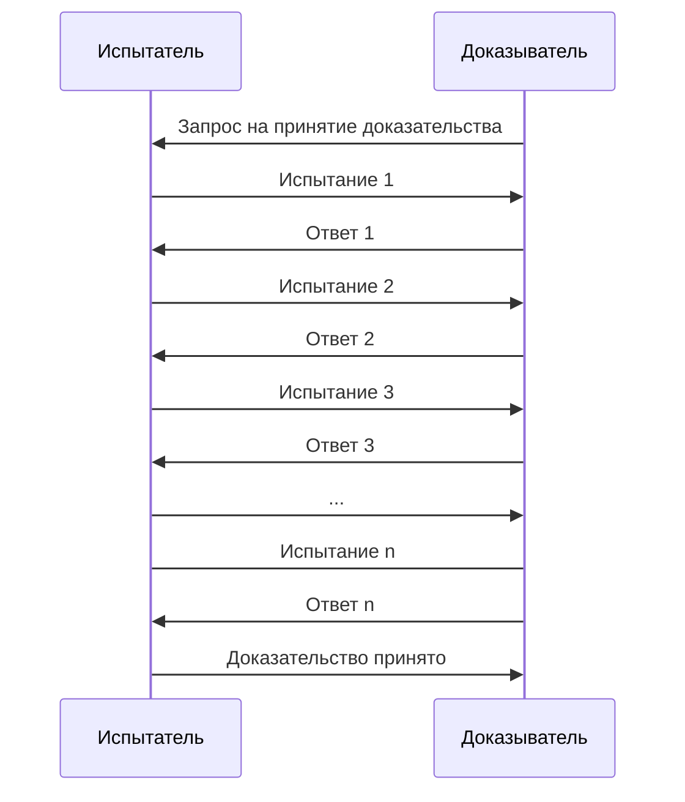
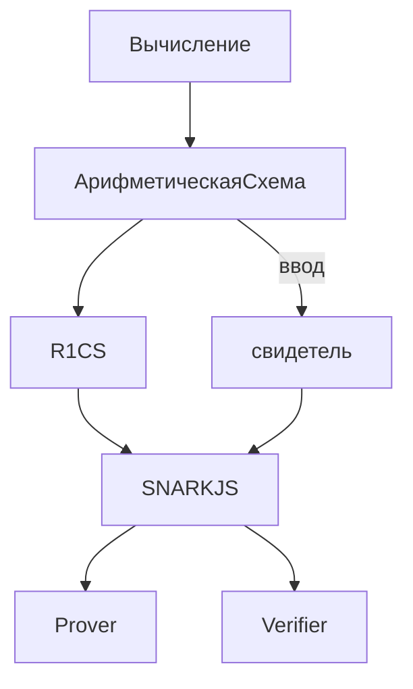

# final1

# Введение

С каждым годом количество сервисов, работающих в интернете растет с неимоверной скоростью. Все больше различных услуг доступно для обычных пользователей. Денежные переводы, сообщения и письма, данные для аутентификации - все это желательно делать быстро и конфиденциально. С помощью криптографии стало возможно покрыть оба эти пункта. Однако протоклы имеют свойство устаревать и поэтому появляются новые, более эффективные и надежные способы передачи информации.
Одним из важнейших достижений криптографии за последние годы стали "Доказательства с нулевым разглашением"(Zero-Knolwedge Proofs, далее ZKP). Этот метод передачи данных позволяет двум разным сторонам обмениваться информацией, ничего не раскрывая. Значительную популярность он получил в том числе изза своей большой значимости для blockchain(цепь блоков - распределенная база данных, которая совместно используется узлами компьютерной сети???) ****и Internet of Things(IOT, интернет вещей) ZKP являются важными составляющими. Более привычными же примерами использования ZKP являются: анонимные голосования и выборы, аутентификация, доказательства правдивости новостей, доказательства того, что ваши деньги не были вами украдены и т.д.

Главными проблемами в реализации протоколов на основе ZKP долгое время были стандартизация формирования таких доказательств, а также большое время их проверки. С другой стороны важнo было упростить созданиe доказательств для обычных разработчиков без опыта в криптографии. В последние годы эта отрасль развилась значительно. Было предствалено множество исследований на тему ZKP, предложены алгоритмы реализации формирования доказательств и их проверки, а также созданы новые предметно-ориентированные языки(далее dsl), позволяющие реализовать ZK(zero-knowledge) протоколы. Однако логика написания таких программ значительно отличается от привычных языков, а следовательно необходимо разработать способы отладки программ и поиска уязвимостей в них.
В основном используют статический анализ, фаззинг и символическое исполнение.

# 1 Доказательства с нулевым разглашением и их применение

В данной главе будет рассказано про принципы работы ZKP,  zk-SNARKs и PLONK.

## 1.1 Доказательства с нулевым разглашением

ZKP - это доказательства, которые в одно время являются убедительными и в то же время не раскрывают ничего, кроме факта верности доказываемого утверждения [1]. 

Задачей ZKP является сокрытие любой важной информации, необходимой для формирования доказательства. Обычно стороны обозначают как Доказыватель(Prover) и Испытатель(Verifier)(далее P и V).

Три главных свойста, определяющих ZKP:

1. Completeness(Полнота) - если утверждение P верно, то он сможет убедить в этом V(по крайней мере с большой вероятностью).
2. Soundness(Надежность/Корректность) - P может убедить V в верности своего утверждения, только в случае, если оно действительно верно.
3. Zero-knowledge(Нулевое разглашение) - V не узнает ничего важного об утверждении P, кроме факта его верности.

Существует несколько типов нулевого разглашения:

1. Идеальное нулевое разглашение(perfect zero-knowledge) - даже сторона c неограниченными ресурсами для вычислений не способна отличить настоящее доказательство от подделанного.(или является ли подделанное доказательство валидным)
2. Статистическое нулевое разглашение(statistical zero-knowledge) - сторона с неограниченными ресурсами для вычислений способна отличить настоящее доказательство от подделанного с незначительный вероятностью.
3.  Вычислительное нулевое разглашение(computational zero-knowledge) - не существует эффективного алгоритма, который способен различить настоящее доказательство и подделанное.

Возможность отличать настоящее доказательство от подделанного является ключевой для злоумышленника.

Так как последнее проще всего реализуется, оно является самым распространенным типом нулевого разглашения.

Примеры

- Заявления о фактах: Вы хотите доказать, что “число N - составное”.
- Заявления о личных знаниях(arguments of knowledge): Вы хотите доказать, что “вы знаете разложение N на простые множители”.

Вы можете очень быстро проверить, что число N составное, не зная его факторизации. Однако, зная что число составное, в общем случае довольно сложно найти его факторизацию.

Второй пример является аргументом знания(argument of knowledge). Аргументы знания входят в класс вычислительных нулевых разглашений. Они очень полезны для доказывания множества утверждений, которые мы используем в реальной жизни [2].

Примеры использования в реальной жизни:

- Пусть F - программа, которая работает две недели на вашем ноутбуке и два дня в дата-центре(указать определение). Таким образом дата-центр может прислать результат работы F, а так же доказательство того, что вычисления были верными.
- Блок в цепи блоков, а также все предыдущие блоки являются верными. Это полезно, когда размер цепи достигает нескольких гигабайт.

### 1.2 Интерактивность

Изначально ZKP задумывался как интерактивный протокол. В общем он включал в себя некоторое количество коммуникаций между P и V, в которых V посылет P опеределенное испытание. P посылает ответ, после чего V на его основе либо не принимает доказательство, либо отправляет еще одно испытание, пока вероятность того, что все испытания были пройдены наугад, не станет незначительной.



Рисунок 1 - схема интерактивного zkp.

С помощью Преобразования Фиата-Шамира - методика трансформации интерактивного ZKP в неинтерактивное. Последнее означает, что доказательство возможно сгенерировать на стороне P и далее его может проверить кто угодно, тогда как в случае интерактивного ZKP уверенным в утверждении может быть только один V.

Если определенный генератор случайных чисел может быть построен с помощью данных, известных обеим сторонам, тогда любой интерактивный протокол может быть трансформирован в неинтерактивный [4].

## 1.2 zk-SNARKs

zk-SNARK - Zero-Knowledge Succinct Non-Interactive Argument of Knowledge(Краткие неинтерактивные аргументы знания с нулевым разглашением). Это семейство протоколов(zk-SNARKs), основанных на ZKP. В них одна сторона может доказать другой стороне, что она владеет информацией, без раскрытия этой информации. Также в данном протоколе отсутствует взаимодействие между сторонами.

Основным преимуществом данного семейства протоколов является очень мальенькое время проверки доказательства, даже если предмет доказательства требует большого количества вычислений, а также малый размер доказательства [5]. 

В основном, в таких доказательствах необходимо проверить каждую часть выполнения программы, фактически не запуская эту программу. Это становится возможно, если представить программу ввиде арифметической схемы.

zk-**SNARKs можно использовать в том числе для доказательства правильности вычеслений компьютерной программы**.

### 1.2.1 Арифметические cхемы

В теории компьютерных вычислений, арифметическая схема - стандартная модель для вычисления многочленов. В данной модели можно складывать или умножать выражения, которые уже были вычислены, на основе входных данных. Формально это ориентированный ациклический граф. Каждая вершина с нулевой степенью входа - входной вентиль(input gate). Каждая грань - провод(wire). Каждый вентиль имеет два входных и один выходной провод.

.png)

Рисунок 1 - арифметическая схема для многочлена $(x_1 + x_2)x_2(x_2 + 1)$ (я это перереисую так как тут есть неквадратичная чаасть) 

[6].

Выполнение Арифметической схемы - подсчет свидетеля(witness). Свидетель - значения на всех проводах так, чтобы входы и выходы каждого вентиля удовлетворяли ограничению, определяемому операцией вентиля. На рисунке 1 свидетелем является w = (s1, s2, s3, s4, s5, s6, s7, s8, s9). И все они удовлетворяют ограничениям:

$$
1)\ s_1 + s_2 = s_6\\2)\ s_4 + s_5 = s_7\\3)\ s_3 s_6 = s_8\\4)\ s_8 s_7 = s_9\\5)\ s_2 = s_3 = s_4
$$

[7].

### 1.2.2 Квадратичные арифметические программы и R1CS

R1CS - rank-1 constraint system(система ограничений ранга 1). Это последовательность строк, хранящая в себе значения, которым должны соответствовать переменные во время работы программы. Она же ****связывает отношения между всеми ними во время вычисления. Эти отношения называются “ограничениями”(constraints) или “вентилями”(gates).[8] [10]

Допустим, w = (s1, s2, s3, s4,…, sn). Тогда для каждого вентиля будет существовать такие линейные комбинации w Ai, Bi и Ci, что:

Ai * Bi - Ci = 0. Ai = (w, ai), Bi = (w, bi), Ci = (w, ci)

Наборы таких значений и будут составлять r1cs.

Пример по рисунку 1 для вентиля 4:

|  | a | b | c |
| --- | --- | --- | --- |
| 1 | 0 | 0 | 0 |
| 2 | 0 | 0 | 0 |
| 3 | 0 | 0 | 0 |
| 4 | 0 | 0 | 0 |
| 5 | 0 | 0 | 0 |
| 6 | 0 | 0 | 0 |
| 7 | 0 | 1 | 0 |
| 8 | 1 | 0 | 0 |
| 9 | 0 | 0 | 1 |

(w, a) * (w, b) - (w, c) = (s8 * 1) * (s7 * 1) - (s9 * 1) = 0

КАП(QAP) - специальная форма программы, которая получена из R1CS, преобразованием ее в арифметическое выражение, с использованием многочленов. Это делается с помощью r1cs представления программы, все уравенения вида (w, ai) * (w, bi) - (w, ci)  = 0 могут быть записаны с помощью трех многочленов, которые принимают значения (w, i), (w, bi) , (w, ci) при определенном аргументе ri.

Многие zk-SNARKs используют это представление.

Выполнимость арифметических схем - NP-полный язык. Значит для любого NP-вычисления можно построить арифметическую сзему для этого вычисления таким образом, что свидетель, удовлетворяющий схеме  - свидетель оригинального вычисления. Таким образом убеждаясь в правильности свидетеля для КАП, V одновременно убеждается в правильности свидетеля из оригинального вычисления [7].

## 1.3 PLONK

— trusted setup

— plonkish arithmetization

# 2 Circom

В данном разделе будут рассмотрен предметно-ориентированный язык circom. Также будет рассмотрен компилятор для этого языка - circom compiler. 

Это один из самых первых и самых используемых dsl для написания схем на данный момент. Удобным для использования его также делает стандартная библиотека базовых примитивов, таких как операции с двоичным представлением числа, операции на эллиптических кривых, sha256 и т.д.

Circom и другие dsl используются для описания вычислений вместе с рядом ограничений на входные и выходные значения(известные как сигналы, signals).

(Tornado.cash was developed using Circom))

## 2.1 Circom Language

Circom - предметно-ориентированный язык, который был разработан для написания арифметических схем используемых в zkp. В частности он был разработан для работы с javascript библиотекой snarkjs. [15]

Он позволяет создавать массивные схемы, используя много маленьких компонент.

Данный язык значительно отличается от привычных нам языков программирования. Одако синтаксис языка заимствуется у js/c с добавлением нескольких операций:

пример cхемы реализующей операцию **не и**

```jsx
pragma circom 2.0.0; 

template NAND() {
    signal input a;
    signal input b;
    signal output out;

    out <== 1 - a*b;
    a*(a-1) === 0;
    b*(b-1) === 0;
}

component main = NAND();
```

```c
<==, ==> - используются для объединения сигналов и наложения ограничений на переменные
<--, --> - используются для объединения сигналов
=== - используется для наложения ограничений на переменные
```

Как мы видим, есть два входных сигнала (a, b) и выходной сигнал (out).  Сигналу out присвоено значение 1 - a * b и наложено ограничение что out должен быть равен 1 - a * b при проверке.  Далее проверяется что a и b находятся в множестве {1, 0}.

Все ограничения должны быть в виде квадратичных ограничений.

Данная схема работает с элементами конечного поля по модулю простого числа p = 21888242871839275222246405745257275088548364400416034343698204186575808495617

Этот язык с одной стороны определяет верность выражения, а с другой стороны описывает вычисления. Вычисление и Проверка - разные операции, описанные одной схемой.

## 2.2 Circom Compiler

Circom Compiler - компилятор языка circom, написанный на языке Rust. Он используется для генерации R1CS файла с ограничениям наложенными схемой и программой, которая будет эффективно cчитать witness(правильное значение на выходе программы, соответствующее всем ограничениям). Также он создает prover и verifier. Prover может быть использован для вычисления, описанного dsl при публичных и приватных входных сигналах, вместе с доказательством того, что вычисление было корректно. Verifier может иметь публичные входные данные и выходной сигнал вычисления, чтобы проверить верность доказательства, созданного prover.



## 2.3 Пример создания церемонии, доказательства и проверки.

Для компиляции схемы необходимо воспользоваться утилитой **circom**. Пусть файл со схемой, описанной выше, называется **main.circom**.


рисунок t - компиляция схемы с созданием R1CS файла, sym файла(свидетель в симметричном формате) и программы, считающей witness на языке программирования WebAssembly.

Для подсчета witness необходимо использовать утилиту snarkjs


--дописать про этапы
## 3 Верификация

—без верификации могут напрямую приводить к потере средств
—в основном 
- smart-contracts
- системы аутентификации
это закончить

### 3.1 Зачем нужна верификация

Верификация необходима во всех видах разработки программ. Написание арифметических схем ничем от этого не отличается. Однако в случае с уже известными языками программирования способы отладки и поиска неисправностей налажены систематически. В случае же языков для написания арифметических схем могут встречаться неисправности, которые сложно найти, а отладить не получится в силу специфки языков. Арифметические схемы всегда являются составной частью, какого-то большого приложения.

Если проблема была в системе доказательств, в зависимости от значимости ошибки, это может вызвать очень множество неудобств, как для производителя, так и для пользователя. В основном производителю придется вносить радикальные изменения в по и удостовериться, что пользователи переустановят приложение.

Очень важно выявлять такие ошибки еще во время написания по. Однако, так как отрасль довольно новая и представлено немного классов уязвимостей таких приложений, требуются различные подходы к тестированию такого ПО. Одним из них является верификация частей схемы с использованием символического исполнения.

Данный метод очень хорошо себя проявляет в связке с другими способами поиска ошибок в арифметических схемах. Самые распространненные:

- Статический анализ кода
- Формальная верификация
- Фаззинг
- Дифферинциалльный фaззинг

Все эти методы затрагивают разные части работы схемы, а также имеют разную вовлеченность человека.

### 3.2 Символическое исполнение

Символическое исполнение - это метод тестирования программного обеспечения, который полезен для генерации тестовых данных и подтверждения качества программы. Исполнение требует выбора путей, которые осуществляются набором значений данных. Программа, которая выполняется с использованием фактических данных, приводит к выводу ряда значений. В символическом исполнении данные заменяются символическими значениями с набором выражений, по одному выражению на выходную переменную. [11]

### 3.2.1 Z3

z3 - SMT(Satisfiability Modulo Theories) - утилита для доказательства теорем [12]. Она базируется на символьном исполнении и в основном работет с математическими выражениями. Данная утилита прекрасно подходит для нахождения ошибок в арифметических схемах, ведь их структура сама по себе является набором уравнений.

Большим преимуществом верификации является то, что она невилирует определенный класс ошибок, которые может быть проблематично искать человеку вручную. 

С другой стороны затраты человека в этом случае тоже довольно высоки.

### 3.3 В каких случаях полезно символьное исполнение

1. Слабая верификация(Уникальный ввод/вывод)
    - Это тестируется, если для данного ввода, вывод КАП имеет однозначно определенные значения.
2. Уникальность свидетеля
    - Это тестируется, если все значения свидетеля, которые появляются во всех уравнениях, также определены однозначно.
3. Cтрогая уникальность
    - Это тестируется, если КАП строго эквивалентно некоторой математической спецификации.
    - Очень похоже на корректность работы функции.

 [13]

# 4 Верификация sha256(неполная)

В данном разделе я приведу результаты анализа реализации примитива sha256 smallSigma, разработанного на языке circom. Весь код взят из [14].

// тут будут куски из https://github.com/Sarkoxed/Research.git

# 5 Приложение

# 6 Cсылки

[1] [https://www.wisdom.weizmann.ac.il/~oded/PSX/zk-tut02v3.pdf](https://www.wisdom.weizmann.ac.il/~oded/PSX/zk-tut02v3.pdf).

[2] [https://blog.cryptographyengineering.com/2014/11/27/zero-knowledge-proofs-illustrated-primer/](https://blog.cryptographyengineering.com/2014/11/27/zero-knowledge-proofs-illustrated-primer/)

[4] [https://ru.frwiki.wiki/wiki/Heuristique_de_Fiat-Shamir](https://ru.frwiki.wiki/wiki/Heuristique_de_Fiat-Shamir)

[5] h[ttps://vitalik.ca/general/2019/09/22/plonk.html](https://vitalik.ca/general/2019/09/22/plonk.html)

[6]  [https://en.wikipedia.org/wiki/Arithmetic_circuit_complexity](https://en.wikipedia.org/wiki/Arithmetic_circuit_complexity)

[7] [https://arxiv.org/pdf/2202.06877.pdf](https://arxiv.org/pdf/2202.06877.pdf)

[8] [https://www.zeroknowledgeblog.com/index.php/the-pinocchio-protocol/r1cs](https://www.zeroknowledgeblog.com/index.php/the-pinocchio-protocol/r1cs)

[10] [https://github.com/iden3/r1csfile/blob/master/doc/r1cs_bin_format.md](https://github.com/iden3/r1csfile/blob/master/doc/r1cs_bin_format.md)

[11] [https://coderlessons.com/tutorials/kachestvo-programmnogo-obespecheniia/slovar-testirovaniia-programmnogo-obespecheniia/simvolicheskoe-ispolnenie](https://coderlessons.com/tutorials/kachestvo-programmnogo-obespecheniia/slovar-testirovaniia-programmnogo-obespecheniia/simvolicheskoe-ispolnenie)

[12] [https://theory.stanford.edu/~nikolaj/programmingz3.html#sec-intro](https://theory.stanford.edu/~nikolaj/programmingz3.html#sec-intro)

[13] [https://www.youtube.com/watch?v=SxI8uNBp05k&t=4739s](https://www.youtube.com/watch?v=SxI8uNBp05k&t=4739s)

[14] https://github.com/iden3/circomlib

[15] https://docs.circom.io

[16] https://github.com/Sarkoxed/Research.git
